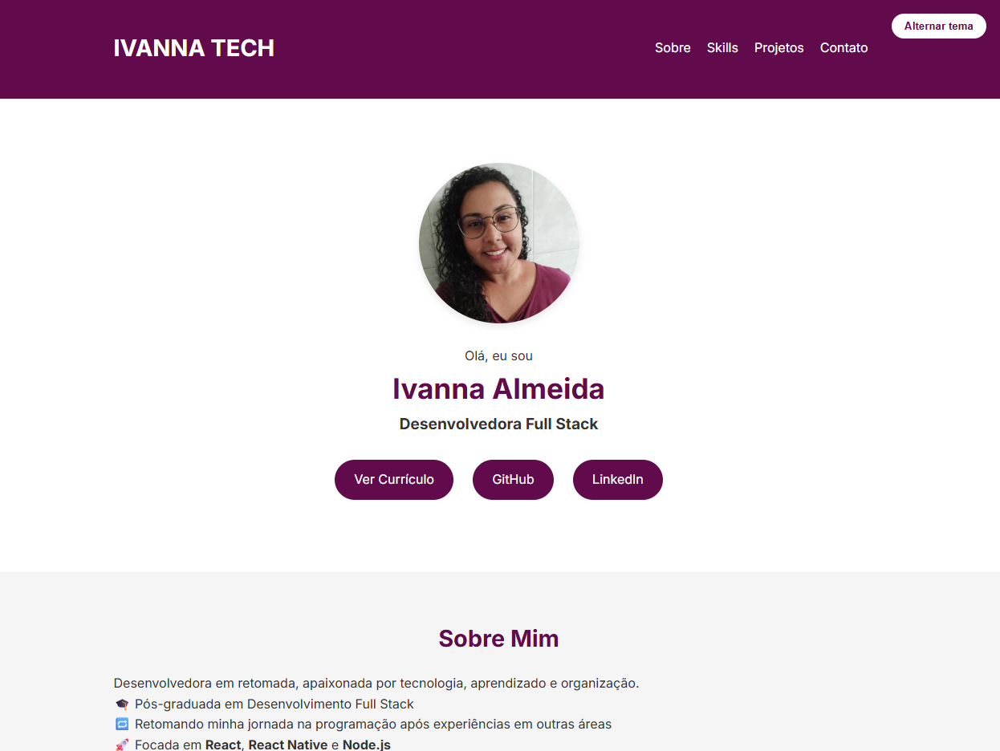

# 🌐 Portfólio - Ivanna Tech

Bem-vindo(a) ao meu portfólio pessoal! Este projeto foi desenvolvido com foco na apresentação da minha trajetória, habilidades, projetos e canais de contato. É também um exercício prático de HTML, CSS e organização para web.

## 👩‍💻 Sobre Mim

Sou Ivanna Almeida, desenvolvedora em retomada na área de tecnologia, com pós-graduação em Desenvolvimento Full Stack. Apaixonada por React, React Native e Node.js, estou continuamente evoluindo e construindo soluções com foco em aprendizado, organização e design acessível.

---

## 🛠 Tecnologias Utilizadas

- **HTML5**
- **CSS3**
- **JavaScript (básico)**
- **Responsividade com Flexbox e Grid**
- **Modo claro/escuro (dark mode)**
- **Animações com CSS**

---

## 🧩 Funcionalidades

- ✅ Layout responsivo
- ✅ Seções: Sobre, Skills, Projetos e Contato
- ✅ Links diretos para GitHub, LinkedIn e currículo
- ✅ Dark mode com toggle
- ✅ Formulário de contato (ainda não funcional)
- ✅ Estilo limpo, moderno e com foco na usabilidade

---

## 📸 Capturas de Tela

---

## 🔗 Links Importantes

- [GitHub - Ivanna Tech](https://github.com/ivannatech)
- [LinkedIn - Ivanna Almeida](https://www.linkedin.com/in/ivanna-almeida/)

---

## 🚀 Projetos em Destaque

| Projeto | Descrição | Link |
|--------|-----------|------|
| **Corrida dos Ratos** | Jogo sobre finanças pessoais e investimentos. | [Ver no GitHub](https://github.com/ivannatech/jogo_corrida_dos_ratos_v2_publica) |
| **Quiz Interativo** | Aplicativo em React Native com perguntas e respostas. | [Ver no GitHub](https://github.com/ivannatech/App_Quiz) |
| **Calculadora de Média** | Projeto educacional simples. | [Ver no GitHub](https://github.com/ivannatech-archive/old-calculadora-de-media-imersao-dev) |
| **Site Amplia** | Página estática desenvolvida em HTML e CSS. | [Ver no GitHub](https://github.com/ivannatech-archive/old-amplia-abrete-codigo) |

---

## 📬 Contato

Entre em contato comigo por e-mail ou pelas redes sociais:

- ✉️ ivannatech@gmail.com
- 💼 [LinkedIn](https://www.linkedin.com/in/ivanna-almeida/)
- 🖥️ [GitHub](https://github.com/ivannatech)

---

## 📌 Observações

Este portfólio é um projeto em constante evolução. Em breve, integrarei mais funcionalidades com JavaScript e melhorias no formulário de contato.

---

## 📄 Licença

Projeto pessoal e aberto para fins de inspiração e aprendizado. Uso livre com créditos.

---

